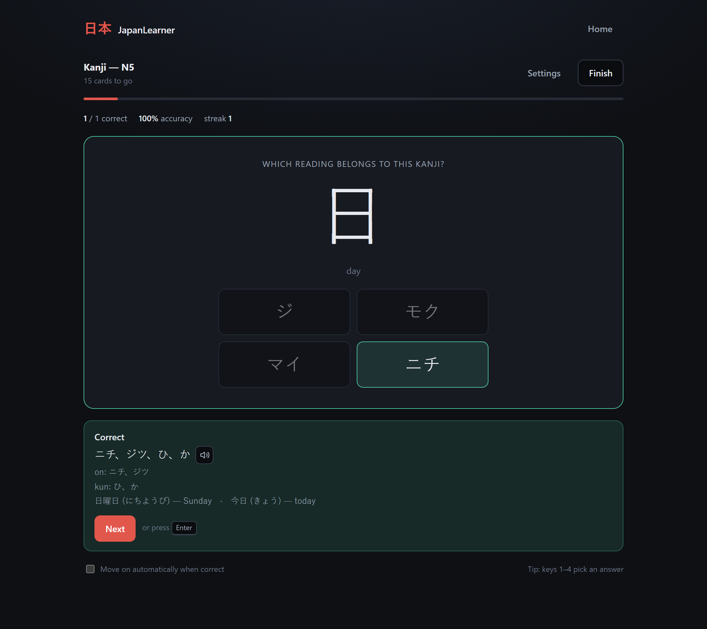
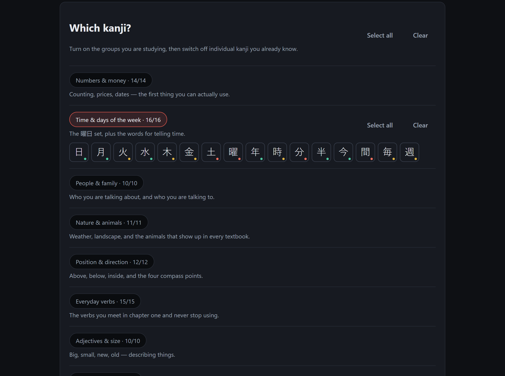
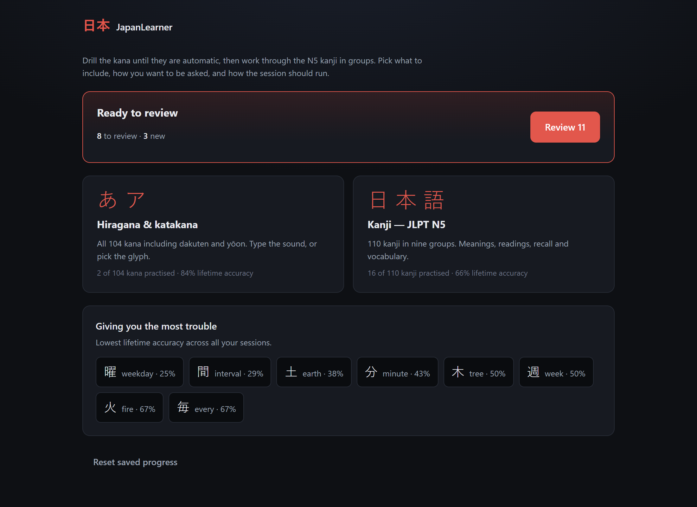

# 日本 JapanLearner

A practice app for learning Japanese: drill the kana until they are automatic,
then work through the JLPT N5 kanji in groups. It schedules your reviews, so
the daily question is "what's due?" rather than "what should I study?" — but
you can still pick exactly what to drill and how to be asked.

Built with React, TypeScript and Vite. Everything runs in the browser — no
account, no backend, no network calls. Progress is kept in `localStorage`.



## Quick start

```bash
npm install
```

```bash
npm run dev
```

Then open http://localhost:5173.

| Script | What it does |
| --- | --- |
| `npm run dev` | Start the dev server |
| `npm run build` | Production build into `dist/` |
| `npm run preview` | Serve the production build |
| `npm test` | Romaji conversion and session-engine tests |
| `npm run typecheck` | `tsc --noEmit` |

## Hiragana & katakana

All 104 kana — the basic 46, dakuten and handakuten (が ざ だ ば ぱ), and yōon
(きゃ しゃ ちゃ …). Practise hiragana, katakana, or both together, and switch
individual rows on and off so you only drill what you are actually working on.

- **Recognition** — see か, type `ka`.
- **Recall** — see `ka`, pick か out of four. Harder, and it sticks better.

## Kanji — JLPT N5

110 kanji arranged in nine themed groups, so you can study a coherent set rather
than an alphabetical slice:

| Group | Contents |
| --- | --- |
| Numbers & money | 一 二 三 … 百 千 万 円 |
| Time & days of the week | 日 月 火 水 木 金 土 曜 年 時 分 半 今 間 毎 週 |
| People & family | 人 男 女 子 母 父 友 先 生 名 |
| Nature & animals | 山 川 天 気 雨 花 空 田 石 犬 魚 |
| Position & direction | 上 下 中 外 前 後 左 右 東 西 南 北 |
| Everyday verbs | 行 来 見 聞 食 飲 言 話 読 書 入 出 立 休 買 |
| Adjectives & size | 大 小 高 安 新 古 長 白 多 少 |
| Places & things | 国 学 校 本 語 車 駅 店 会 社 電 何 |
| Body & other basics | 目 耳 口 手 足 力 体 文 字 正 |

Turn whole groups on or off, then exclude individual kanji you already know. Each
kanji carries its meanings, on'yomi, kun'yomi and two vocabulary words.



The dot under each character is your lifetime accuracy on it — green, amber or
red — so you can see at a glance what to keep in and what to drop.

Four ways to be drilled, each independently set to **typing** or **multiple
choice**:

| Mode | You see | You answer |
| --- | --- | --- |
| Kanji → meaning | 日 | day / sun |
| Kanji → reading | 日 | ニチ, ジツ, ひ or か |
| Meaning → kanji | "day / sun" | 日 |
| Vocabulary | 日本 | にほん |
| Listening | 🔊 にほん | 日本 — にほん |

## Reviews

The home screen opens on what is due today. Answer it right and the item moves
up a box and comes back later; miss it and it drops back to daily.

| Box | Next review |
| --- | --- |
| 1 | tomorrow |
| 2 | in 3 days |
| 3 | in a week |
| 4 | in 2 weeks |
| 5 | in a month |

An item counts as known only if you answered it without a slip, so one miss
keeps it in the daily box.

Two rules keep this from becoming a chore. **Due items always come back**, even
if you have since unticked the group they live in — once you have started
learning 日 it should not quietly disappear. **New items only come from your
current selection**, at most 15 a day, so a fresh install is a manageable
handful rather than 300 cards.

Scheduling is per item, not per item-and-mode. Knowing 日 → "day" is admittedly
not the same as knowing 日 → ニチ, but scheduling those separately triples the
daily load, which is the surest way to stop reviewing at all. The review deck
picks a random enabled mode each time an item comes round, so both get
exercised over the weeks.

Practising a deck yourself never touches the schedule — drilling something ten
times in an afternoon should not push its next review out a month.

## How a session runs

Pick the shape of the session independently of what is in it:

- **One pass** — every card once, then a summary.
- **Repeat mistakes** — anything you miss comes back a few cards later, and the
  session only ends once you have answered everything correctly.
- **Endless** — keeps going until you stop, with weak cards coming round more
  often.

Cards run in list order or shuffled. Correct answers advance automatically (you
can turn that off); misses wait so you can read the answer, the readings and the
example words. Typing `Enter` checks and continues; in multiple choice, keys
`1`–`4` pick an option.

The results screen shows accuracy, best streak and everything you missed, with a
one-click **practise the ones you missed** to drill just those.

## Look-alike options

Multiple choice is only as good as its wrong answers. Picking か out of か, ぬ,
ほ, り proves nothing; picking シ out of シ, ツ, ソ, ン is the distinction that
actually costs you marks. So when the options are characters, the app fills the
distractor slots with genuine look-alikes first and only falls back to random
ones when none are in your current selection.

It knows the usual traps in both scripts — シ/ツ/ソ/ン, ク/タ/ワ/ケ, ノ/メ/ヌ/ス,
ね/れ/わ, は/ほ/ま, さ/き/ち — and the kanji ones too: 木/本/休/体, 日/白/目/百,
人/入/八, 語/話/読/言, 聞/間, 母/毎.

## Audio

If your device has a Japanese voice installed, readings and vocabulary can be
played aloud: a speaker button appears next to the answer whenever a card is
revealed, and there is a **Listening** mode where the audio *is* the question —
you hear にほん and write down what you heard.

This uses the browser's built-in speech synthesis, so there is no network call
and nothing to install in the project. It does need a Japanese voice from the
operating system. On Windows that is **Settings → Time & language → Language &
region → Add a language → 日本語**, making sure *Speech* is included in the
optional features; then restart the browser. Without one, the Listening mode is
shown disabled and the speaker buttons stay hidden — everything else works
exactly as before.

## Answer checking

Typed readings are converted from romaji to kana, so the app accepts what a
learner would actually type:

| You type | Accepted as |
| --- | --- |
| `shi` / `si` | し |
| `tsu` / `tu` | つ |
| `fu` / `hu` | ふ |
| `ja` / `jya` / `zya` | じゃ |
| `gakkou` | がっこう (sokuon) |
| `shinbun`, `nanji` | しんぶん, なんじ (syllabic ん) |
| `hon` / `honn` | ほん |

You can also type kana directly. Readings stored as `い(く)` accept either the
stem (`i`) or the whole word (`iku`). Meanings ignore case, punctuation, leading
articles and a leading "to", so `go` and `to go` both count.

## Progress

Everything is stored in `localStorage`: lifetime accuracy per item, which drives
the *giving you the most trouble* list and the mastery dots in the kanji picker,
plus each item's box and due date. There is a reset button on the home screen.



## Project layout

```
src/data/         kana and kanji datasets, plus the look-alike sets
src/lib/romaji    romaji ⇄ kana conversion and answer matching
src/lib/session   the session engine (queue, flows, scoring)
src/lib/buildCards  turns a dataset + settings into practice cards
src/lib/schedule  Leitner boxes: when an item comes back
src/lib/review    composes the deck for a review session
src/lib/storage   localStorage persistence
src/lib/speech    Japanese text-to-speech, and whether a voice exists
src/components/   home, the two setup screens, quiz, results
tests/            romaji, session-engine, scheduling and storage tests
scripts/          regenerates the README screenshots
```

The session engine is deck-agnostic: both decks compile down to a list of
`Card`s, each carrying its own prompt, accepted answers and grading function. So
adding a deck — N4 kanji, a vocabulary list, counters — means writing a card
builder, not another quiz screen.

`npm test` covers the romaji conversion in both directions, the answer matching,
and the session flows. It also asserts two properties across the whole dataset:
every card accepts at least one answer derivable from what it displays, and every
multiple-choice question has exactly one correct option.

## Ideas for later

- A full N5 vocabulary deck, including the kana-only words
- Counters, dates and times, with their sound changes
- Particle and conjugation drills
- Stroke-order diagrams and handwriting practice
- N4 and beyond

## License

MIT — see [LICENSE](LICENSE).
