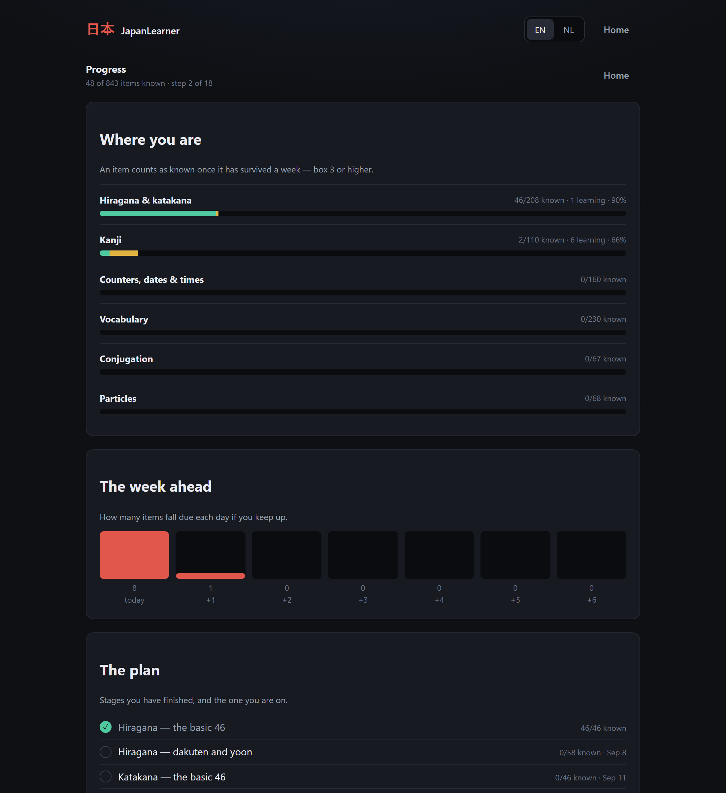
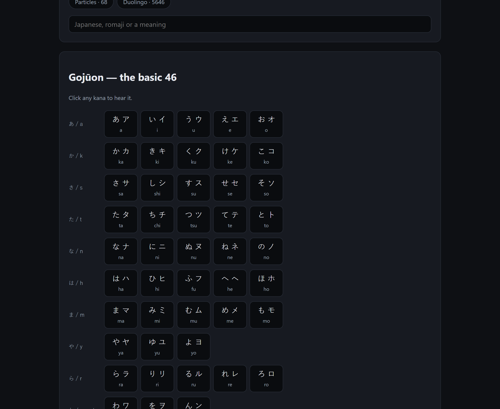

# 日本 JapanLearner

A practice app for learning Japanese, covering N5 across six decks: the kana,
the kanji, the counters and dates that never behave, the core vocabulary, how
verbs and adjectives conjugate, and which particle a sentence takes. It schedules your reviews, so
the daily question is "what's due?" rather than "what should I study?" — but
you can still pick exactly what to drill and how to be asked, or put the
questions aside and just read the material.

A seventh deck sits alongside them: the Duolingo course's own word list, all
310 units of it, so the vocabulary that app teaches and then never lets you
go back over can be drilled here.

Built with React, TypeScript and Vite. Everything runs in the browser — no
account, no backend, no network calls. Progress is kept in `localStorage`.


## Where to start

739 items across six decks is a lot to face on day one, and picking well means
knowing things you do not know yet — that the kana come first, that counters
need numbers, that conjugation needs verbs. So the home screen leads with a
plan: eighteen stages in the conventional order, each with a goal and a button
that sets the decks up for it.



A stage is finished when 90% of its items are *known*, which means box 3 or
higher — they have survived a week, not just been answered once. The pass mark
leaves room for a couple of stubborn items rather than letting one kana block
the whole thing.

It suggests and never restricts. Nothing is locked, and choosing decks by hand
works exactly as it did.

## Quick start

```bash
npm install
```

```bash
npm run dev
```

Then open http://localhost:5173.

| Script | What it does |
| --- | --- |
| `npm run dev` | Start the dev server |
| `npm run build` | Production build into `dist/` |
| `npm run preview` | Serve the production build |
| `npm test` | Romaji, session-engine, scheduling and dataset tests |
| `npm run check:data` | Cross-check the datasets against JMdict (needs network) |
| `npm run import:duolingo` | Rebuild the Duolingo deck from duome.eu (needs network) |
| `npm run typecheck` | `tsc --noEmit` |

## Reading it, rather than being asked

Every other screen in this app is a question. This one is not: it lays all
seven decks out to be read, which is what you want when a word is new and being
tested on it is premature.



Each deck brings whatever it carries. The kana are drawn as the syllabary
rather than as a list, because the grid is how anyone learns them. Kanji bring
their on and kun readings and their example words. Particles are shown filled
in — a gap is a question, and this page asks none — with the reason underneath.

The conjugation deck is the one that gains most, because every form is derived
rather than stored and so all of them can be shown at once:

| | |
| --- | --- |
| 書く　かく　to write | ます 書きます　·　て 書いて　·　ない 書かない　·　た 書いた |

There is one search box across the deck you are reading, and it matches the
Japanese, the reading, the meaning and the romaji — so `tegami` finds 手紙 and
`tabemasu` finds 食べます, without a Japanese keyboard. The Duolingo deck is
read a range of units at a time for the same reason its practice screen is,
but search still reaches all 5646 words of it.

The mastery dots are the ones from the setup screens, reading the same saved
accuracy. Nothing on this page is scored, scheduled or counted — looking a word
up here does not tell the scheduler you have seen it.

## Hiragana & katakana

All 104 kana — the basic 46, dakuten and handakuten (が ざ だ ば ぱ), and yōon
(きゃ しゃ ちゃ …). Practise hiragana, katakana, or both together, and switch
individual rows on and off so you only drill what you are actually working on.

- **Recognition** — see か, type `ka`.
- **Recall** — see `ka`, pick か out of four. Harder, and it sticks better.

## Kanji — JLPT N5

110 kanji arranged in nine themed groups, so you can study a coherent set rather
than an alphabetical slice:

| Group | Contents |
| --- | --- |
| Numbers & money | 一 二 三 … 百 千 万 円 |
| Time & days of the week | 日 月 火 水 木 金 土 曜 年 時 分 半 今 間 毎 週 |
| People & family | 人 男 女 子 母 父 友 先 生 名 |
| Nature & animals | 山 川 天 気 雨 花 空 田 石 犬 魚 |
| Position & direction | 上 下 中 外 前 後 左 右 東 西 南 北 |
| Everyday verbs | 行 来 見 聞 食 飲 言 話 読 書 入 出 立 休 買 |
| Adjectives & size | 大 小 高 安 新 古 長 白 多 少 |
| Places & things | 国 学 校 本 語 車 駅 店 会 社 電 何 |
| Body & other basics | 目 耳 口 手 足 力 体 文 字 正 |

Turn whole groups on or off, then exclude individual kanji you already know. Each
kanji carries its meanings, on'yomi, kun'yomi and two vocabulary words.


The dot under each character is your lifetime accuracy on it — green, amber or
red — so you can see at a glance what to keep in and what to drop.

Four ways to be drilled, each independently set to **typing** or **multiple
choice**:

| Mode | You see | You answer |
| --- | --- | --- |
| Kanji → meaning | 日 | day / sun |
| Kanji → reading | 日 | ニチ, ジツ, ひ or か |
| Meaning → kanji | "day / sun" | 日 |
| Vocabulary | 日本 | にほん |
| Listening | 🔊 にほん | 日本 — にほん |

## Reviews

The home screen opens on what is due today. Answer it right and the item moves
up a box and comes back later; miss it and it drops back to daily.

| Box | Next review |
| --- | --- |
| 1 | tomorrow |
| 2 | in 3 days |
| 3 | in a week |
| 4 | in 2 weeks |
| 5 | in a month |

An item counts as known only if you answered it without a slip, so one miss
keeps it in the daily box.

Two rules keep this from becoming a chore. **Due items always come back**, even
if you have since unticked the group they live in — once you have started
learning 日 it should not quietly disappear. **New items only come from your
current selection**, and only up to a budget you set, so a fresh install is a
manageable handful rather than 300 cards.

New items answer to two ceilings, and each means what its name says. A sitting
introduces at most **new items a day**; a week introduces at most that many
times **days a week**. Neither alone works. Capped only by the day, the
days-a-week setting is decorative — someone who asked for fifteen across four
days gets a hundred and five by sitting down all seven, and the date the plan
screen promised was for a course they are no longer taking. Budgeted only by the
week, the allowance arrives in a heap: a fresh install opens on a week's worth
at once, a week away is met with the same wall, and even an ordinary week comes
out lumpy — two big sittings, then two with nothing new left in them.

Together they are smooth. Study the days you promised and you get the same
handful every time; study more and the week's ceiling holds you to the pace you
actually chose. A day you skip is not carried forward into a double session —
the budget is a ceiling, not a debt, and falling behind shows up where it
belongs, in the date on the plan screen.

Reviews are not capped, because an item that is due is due. What the home screen
does instead is say what the session costs before you start it — *110 to review ·
15 new · about 17 minutes* — so a backlog after a fortnight away is a number you
can decide about rather than a surprise you discover forty cards in.

Scheduling is per item, not per item-and-mode. Knowing 日 → "day" is admittedly
not the same as knowing 日 → ニチ, but scheduling those separately triples the
daily load, which is the surest way to stop reviewing at all. The review deck
picks a random enabled mode each time an item comes round, so both get
exercised over the weeks.

Practising a deck yourself never touches the schedule — drilling something ten
times in an afternoon should not push its next review out a month.

## How long it takes

The plan screen asks two questions — how many new items a day, and how many days
a week — and answers with a date.

It is not a slogan. The pace you set there *is* the budget the reviews spend, so
the date is a prediction of what the app will actually do rather than
encouragement. Two properties of the boxes above do the work:

- **Getting one item known takes a fixed run of days.** Introduced today, it
  returns tomorrow, then three days later, and that third answer is what puts it
  in box 3. Four days if you never miss it. Miss it and it drops to the bottom
  and climbs again, so the estimate is paced on your own accuracy.
- **A steady intake settles at a predictable load.** An item in box `b` waits
  `BOX_INTERVALS[b]` days, so at `r` introductions a day exactly `r × interval`
  items sit in that box and exactly `r` fall due each day. Every box below the
  top therefore contributes `r` reviews a day whatever its interval — which is
  why doubling the pace roughly doubles the session, and why the screen says so
  before you commit.

So the screen quotes the cost alongside the date: at 15 a day, seven days a
week, that is about 110 cards a session and eight weeks; at 25 a day it is five
weeks and 164 cards. Minutes come from timing your actual sessions rather than a
guessed seconds-per-card, with a stated default standing in until there is
enough of your own data to use.

Reviews do not observe rest days — an item due on Thursday is still waiting on
Saturday — so studying fewer days a week makes each sitting longer rather than
making the week's work smaller. The screen says that too.

Each of the eighteen stages gets its own projected date, worked in curriculum
order with every item charged to the first stage that calls for it: the ます-form
and て-form stages drill the same verbs, and the plan should not bill you twice
for learning them.

One thing it deliberately does not claim is that you will pass N5. It covers the
843 items this app teaches, at the same 90% per stage the rest of the app uses.
The exam also has listening and reading sections that no flashcard deck reaches.

## Counters, dates & times

160 forms where the number changes shape in front of the counter. Nothing about
knowing 本 tells you that 一本 is いっぽん, 三本 is さんぼん and 六本 is ろっぽん,
so this is the part of N5 that has to be drilled rather than reasoned out.

| Set | What is in it |
| --- | --- |
| Things & people | つ and 人 — ひとつ…ここのつ, ひとり, ふたり, よにん |
| Long, flat & small | 本, 匹 and the mercifully regular 枚 |
| Cups, books & machines | 杯, 冊, 台 |
| Age | 歳, including 二十歳 = はたち |
| Days of the month | ついたち, ふつか, みっか … はつか |
| Telling the time | 時 and 分 — よじ, しちじ, くじ, いっぷん, ろっぷん |
| Months | しがつ, しちがつ, くがつ |
| Hundreds & thousands | さんびゃく, ろっぴゃく, はっぴゃく, さんぜん, はっせん |

Anything whose reading shifts is marked in the picker and called out when the
answer is revealed, so you learn the pattern rather than 160 separate facts.
Ask for the reading, the meaning, or hear it and write it down.

## Vocabulary — N5

230 core words in ten sets, including the ones a kanji deck can never reach
because they are simply written in kana: これ, それ, どこ, とても, たくさん,
ちょっと, ありがとう.

| Set | What is in it |
| --- | --- |
| This, that & which | The こそあど words and the question words |
| People & family | わたし, ともだち, お母さん, 先生 |
| Things around you | かばん, かさ, 時計, 手紙, 自転車 |
| Places | 学校, 銀行, 郵便局, 部屋 |
| Time words | 今日, 明日, 毎日, 先週 |
| Food & drink | ご飯, 野菜, お茶, 飲み物 |
| Verbs | 行く, 食べる, 分かる, 働く |
| Adjectives | 大きい, 新しい, 忙しい, 静か |
| Adverbs & useful words | とても, 少し, いつも, あまり |
| Greetings & set phrases | こんにちは, すみません, いただきます |

Ask for the meaning, the reading, the word from its meaning, or hear it and
write it down. Words already written in kana get no reading card, because the
answer would be the question.

Words that also appear as examples in the kanji deck — 食べる, 学校, 今日 —
share one schedule rather than being asked as two separate items.

## Duolingo — the course word list

Duolingo teaches Japanese vocabulary and then gives you nowhere to go back over
it: the course has no word list, and no practice mode that targets one. This
deck is that list — 5646 words across the course's 310 units, in the order
it teaches them, taken from duome.eu's mirror of the course.

It is a deck in its own right rather than part of the plan above, and that is
the point of it. The N5 decks are a curated route through the exam; this is a
record of what one particular course happened to teach, proper nouns and set
phrases and all. The two overlap by 178 words and are scheduled under
separate item ids, so drilling one does not quietly move the other's mastery
dots.

Units are picked as a range rather than as a set, because that is the question
a Duolingo learner can actually answer: you are on unit 37, so you drill 1–37,
or just the last ten. Open any unit in the range to switch off the words you
already have.

| Mode | What it asks |
| --- | --- |
| Japanese → meaning | See 食べます, answer "eat" |
| Meaning → Japanese | See "eat", produce 食べます |
| Word → reading | See 食べます, answer たべます |
| Listening | Hear たべます, work out which word it was |

Each can be typed or multiple choice, as everywhere else. What is new is a
third setting deciding how the Japanese is written — and with it, how much you
are really being asked:

| Written as | You see | You answer |
| --- | --- | --- |
| the course writes it | 食べます | 食べます — needs a Japanese IME |
| kana | たべます | たべます or `tabemasu` |
| romaji | `tabemasu` | `tabemasu` or たべます |

The course writes most of its verbs with kanji, which makes "meaning → word"
unanswerable on a keyboard with no Japanese IME installed. Writing the Japanese
in kana or romaji instead makes the same deck drillable anywhere, and asking
for the reading is dropped in those two — there is nothing to work out about
みず written みず.

### The readings, and the ones there are none of

duome prints a romanisation beside every word, and wherever there is a kanji in
it that romanisation is pinyin: 読みます comes out `dumimasu`, 肉 `rou`, 人
`ren`. It is a per-character transliteration through a Chinese reading table,
so it is dropped on sight rather than trusted. Readings are established three
other ways, in descending order of confidence:

| How | Words |
| --- | --- |
| written in kana already, so the word is its own reading | 2394 |
| JMdict has that exact written form, or a ます-form conjugates back to it | 2850 |
| nothing reliable, so no reading is claimed | 402 |

The ます-form pass is the one that needed care. The course teaches 食べます long
before 食べる, and no dictionary lists a conjugated form, so the dictionary form
is looked up and then put back through this project's own conjugation rules —
and a candidate is accepted only when conjugating it reproduces the written form
character for character. That is what stops 見ます being matched to 見すます,
which is what searching for it actually returns first.

Two things it does not solve. A written form that is genuinely ambiguous takes
the dictionary's first ranking — 入ります is はいります here, though いります is
also a reading of it — and a stem that is itself a common noun cannot be
searched for at all: asking about 行き returns 行き the noun and 行き先, never
行く. The second is why the dictionary form is derived by rule from the stem
rather than looked for, which is also what keeps 買います away from 買い増す — a
different verb that happens to read かいます.

What is left over is mostly phrases with a particle in the middle — メールを
読みます, うみに行きます — that no dictionary was ever going to give one reading
for. Those entries say so rather than guessing, and get meaning and recall
cards without a reading or listening card, exactly as the kana-only words in
the N5 deck get no reading card.

```bash
npm run import:duolingo
```

fetches the two pages once, caches every dictionary response under
`node_modules/.cache` so a re-run is free, and writes
`src/data/duolingo.generated.ts`.

## Checking the data

The six N5 datasets are hand-authored rather than imported. The obvious sources
are CC-BY-SA, and share-alike data inside an MIT repository is a licensing
tangle that is painful to unpick later. That keeps the licence clean but puts
the burden of correctness on the author, so correctness is checked two ways.
(The Duolingo deck above is the exception and is generated; its tests are
described at the end of this section.)

**Internally**, by `npm test`. Every reading must be kana and must survive the
app's own romaji conversion, every meaning must satisfy the matcher that grades
it, no two words may share a canonical meaning — otherwise "meaning → word"
has two defensible answers — and every multiple-choice question must have
exactly one correct option. The decks also overlap: 51 words and 24 counter
forms also appear as examples in the kanji deck, and where they overlap they
must agree.

**Externally**, by `npm run check:data`, which cross-references every entry
against JMdict through the Jisho API and reports readings that disagree,
meanings that are not corroborated, and forms with no dictionary entry at all.

```bash
npm run check:data            # the vocabulary deck
npm run check:data counters   # counters, dates and times
npm run check:data kanjivocab # the kanji deck's example words
npm run check:data verbs      # conjugation classes, against the POS tags
npm run check:data particles  # particle choices, against a sentence corpus
```

This only ever reads. Nothing fetched is written into the repository, so the
licensing question that kept JMdict out of the data files does not arise — it
is a reference being consulted, not a source being redistributed.

Not every finding is a bug. A form the dictionary does not list is usually
compositional (七台, 六千) and simply unverifiable this way; an uncorroborated
meaning is often just a simpler learner gloss. A **reading that disagrees** is
the one to take seriously. At the last run there were none, across 553
dictionary-backed entries, and every conjugation class the dictionary states
agreed too.

Particles work differently, and the first attempt at checking them was wrong.
A sentence corpus reports a *count* for a search, but its search is tokenised:
手紙が書きます, which is not Japanese, reports more hits than 手紙を書きます.
Comparing those counts ranks the wrong particle first.

What does work is ignoring the count and reading the sentences the corpus
returns, then checking whether they literally contain the collocation. There
the separation is clean — 手紙を書きます appears in seven of them, 手紙が書きます
in none.

That gives a check with a known and fairly narrow reach. It corroborated 29 of
68 collocations verbatim. The other 39 are phrases the corpus simply does not
contain: spot-checking them shows the rival particle scores zero as well, so
their absence says nothing either way. It can catch a wrong particle when the
phrase is present, and is silent otherwise.

## Conjugation

The one deck whose answers are not written down anywhere. Given a verb and its
class, every form is derived: 書く becomes 書きます, 書いて, 書かない and 書いた
by rule, so the forms are exactly as correct as the rules and the class are.

| | Forms |
| --- | --- |
| Verbs | ます, ません, ました, て-form, ない, plain past |
| い-adjectives | くない, かった, くなかった |
| な-adjectives | じゃない, だった, じゃなかった |

Grouped by class, because the class is what decides how a word behaves — with
帰る, 入る, 走る and 知る in their own group, since they end in る and conjugate
as godan anyway. Ask for the form, name a form you are shown, or work back to
the dictionary form. Typed answers accept romaji, kana or the written form:
かいて, `kaite` and 書いて all count.

That leaves the class as the only fallible input, and misfiling one verb would
make every one of its forms wrong. So `npm run check:data verbs` checks each
one against the dictionary's own part-of-speech tag, and the rules themselves
are pinned by a table of about sixty known conjugations.

## Particles

Sixty-odd sentences with a gap in them, grouped by what the particle is doing —
which is what actually decides the answer.

| Group | What it covers |
| --- | --- |
| を | The direct object: パン＿食べます |
| に | Destination, clock times, and where something exists |
| で | Where an action happens, and what it is done with |
| が | Existence, 好き and 分かる, and anything after a question word |
| と, の, も | With, whose, and "too" |
| から, まで | From and until, in time and in space |

Particles are the one thing here no dictionary can settle: nothing states
whether a sentence takes に or で. So the deck is honest about two things.

**Sentences that take more than one particle say so.** 学校に行きます and
学校へ行きます are both right, so both are accepted when typing, and multiple
choice never offers two correct options at once — the reveal then tells you
the other one also works.

**Every sentence carries the collocation that justifies its answer**, and a
test asserts that collocation really is a fragment of the filled sentence, so
it cannot drift into justifying something else. `npm run check:data particles`
then looks each one up in a sentence corpus — see below for how far that
actually gets.

## How a session runs

Pick the shape of the session independently of what is in it:

- **One pass** — every card once, then a summary.
- **Repeat mistakes** — anything you miss comes back a few cards later, and the
  session only ends once you have answered everything correctly.
- **Endless** — keeps going until you stop, with weak cards coming round more
  often.

Cards run in list order or shuffled. Correct answers advance automatically (you
can turn that off); misses wait so you can read the answer, the readings and the
example words. Typing `Enter` checks and continues; in multiple choice, keys
`1`–`4` pick an option.

The results screen shows accuracy, best streak and everything you missed, with a
one-click **practise the ones you missed** to drill just those.

## Look-alike options

Multiple choice is only as good as its wrong answers. Picking か out of か, ぬ,
ほ, り proves nothing; picking シ out of シ, ツ, ソ, ン is the distinction that
actually costs you marks. So when the options are characters, the app fills the
distractor slots with genuine look-alikes first and only falls back to random
ones when none are in your current selection.

It knows the usual traps in both scripts — シ/ツ/ソ/ン, ク/タ/ワ/ケ, ノ/メ/ヌ/ス,
ね/れ/わ, は/ほ/ま, さ/き/ち — and the kanji ones too: 木/本/休/体, 日/白/目/百,
人/入/八, 語/話/読/言, 聞/間, 母/毎.

## Audio

If your device has a Japanese voice installed, readings and vocabulary can be
played aloud: a speaker button appears next to the answer whenever a card is
revealed, and there is a **Listening** mode where the audio *is* the question —
you hear にほん and write down what you heard.

This uses the browser's built-in speech synthesis, so there is no network call
and nothing to install in the project. It does need a Japanese voice from the
operating system. On Windows that is **Settings → Time & language → Language &
region → Add a language → 日本語**, making sure *Speech* is included in the
optional features; then restart the browser. Without one, the Listening mode is
shown disabled and the speaker buttons stay hidden — everything else works
exactly as before.

## Answer checking

Typed readings are converted from romaji to kana, so the app accepts what a
learner would actually type:

| You type | Accepted as |
| --- | --- |
| `shi` / `si` | し |
| `tsu` / `tu` | つ |
| `fu` / `hu` | ふ |
| `ja` / `jya` / `zya` | じゃ |
| `gakkou` | がっこう (sokuon) |
| `shinbun`, `nanji` | しんぶん, なんじ (syllabic ん) |
| `hon` / `honn` | ほん |

You can also type kana directly. Readings stored as `い(く)` accept either the
stem (`i`) or the whole word (`iku`). Meanings ignore case, punctuation, leading
articles and a leading "to", so `go` and `to go` both count.

## Progress

Everything is stored in `localStorage`: lifetime accuracy per item, which drives
the *giving you the most trouble* list and the mastery dots in the kanji picker,
plus each item's box and due date.

Because that is one cleared cache away from gone, and a schedule represents
weeks of work that cannot be reconstructed, the home screen can export it all
as JSON and import it back. Importing replaces what is there and drops any
entry that is not shaped like real stats, so a malformed file cannot put a NaN
due date into the scheduler.


## Project layout

```
src/data/         the six datasets, the look-alike sets, and the study plan
src/data/duolingo the imported Duolingo deck, and the parser for its blob
src/lib/romaji    romaji ⇄ kana conversion and answer matching
src/lib/session   the session engine (queue, flows, scoring)
src/lib/buildCards  turns a dataset + settings into practice cards
src/lib/conjugate the conjugation rules
src/lib/progress  what "known" means, and the numbers behind the dashboard
src/lib/forecast  how long the plan takes at a given pace, and what it costs
src/lib/curriculum  turning a stage into items, progress and a deck of cards
src/lib/schedule  Leitner boxes: when an item comes back
src/lib/review    composes the deck for a review session
src/lib/browse    every deck flattened into lines you can read
src/lib/storage   localStorage persistence
src/lib/speech    Japanese text-to-speech, and whether a voice exists
src/i18n/         English and Dutch interface text, and the content fallback
src/components/   home, plan, progress, browse, the seven setup screens, quiz,
                  results
tests/            romaji, session-engine, scheduling, forecast and storage tests
scripts/          screenshot capture, the JMdict cross-check, the duome import
```

The session engine is deck-agnostic: every deck compiles down to a list of
`Card`s, each carrying its own prompt, accepted answers and grading function. So
adding a deck — N4 kanji, a vocabulary list — means writing a card builder, not
another quiz screen. The counters deck was exactly that: a dataset and a
builder, with the scheduler, the review flow and the audio all working on it
unchanged.

`npm test` covers the romaji conversion in both directions, the answer matching,
and the session flows. It also asserts two properties across the whole dataset:
every card accepts at least one answer derivable from what it displays, and every
multiple-choice question has exactly one correct option.

The imported deck is held to a different standard, because it has to be. The
hand-written decks are tested for craftsmanship — that no two words claim the
same gloss, that every reading is typeable. Nothing like that can be asked of
5646 imported rows, so what is tested there is that the builder copes without
it: that a gloss shared by a dozen words never puts two defensible options on
one multiple-choice question, that every word sharing a gloss is accepted when
the answer is typed, and that an entry with no reading gets the cards it can
and not the ones it cannot.

## Ideas for later

- Sentence reading, with a furigana toggle
- One shared picker component behind the six setup screens
- Stroke-order diagrams and handwriting practice
- N4 and beyond

## License

MIT — see [LICENSE](LICENSE).
